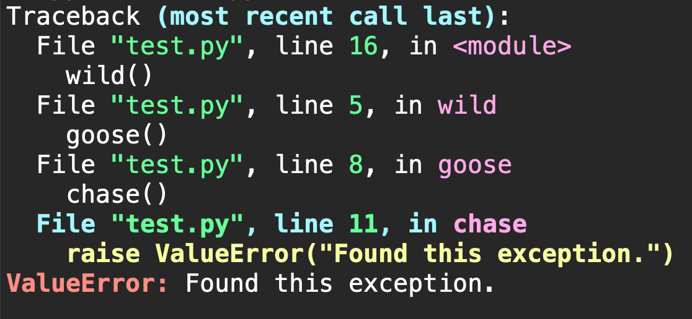

# excolour
A very simple convenience package to colour exception traces.




### Usage
One might find themselves colouring exception traces by setting the ```sys.excepthook```. Rather than have to include this block at the start of code whenever desired, you can:

***Import this package***
```python3
import excolour
```

or

***Run as module***
```bash
python -m excolour myscript.py [args]
```


If you're after a more verbose exception output, you could just use ```ipython``` to run your script instead.

### Installation
```bash
pip install git+https://github.com/nickdrhodes/excolour
```
